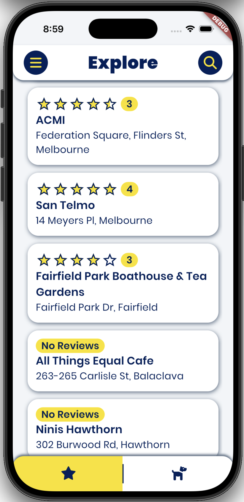
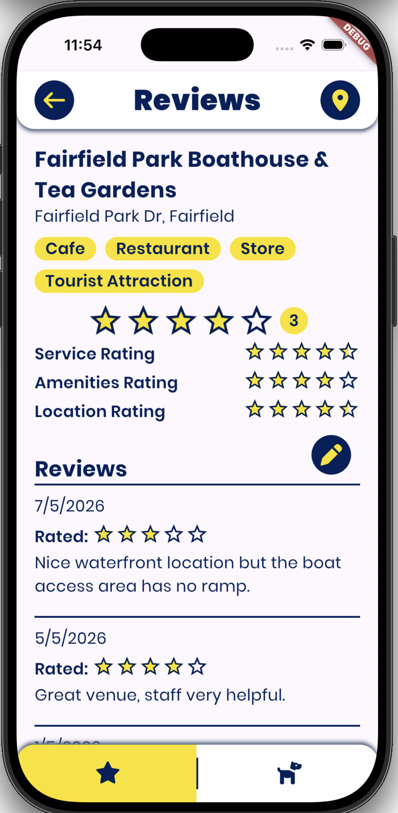
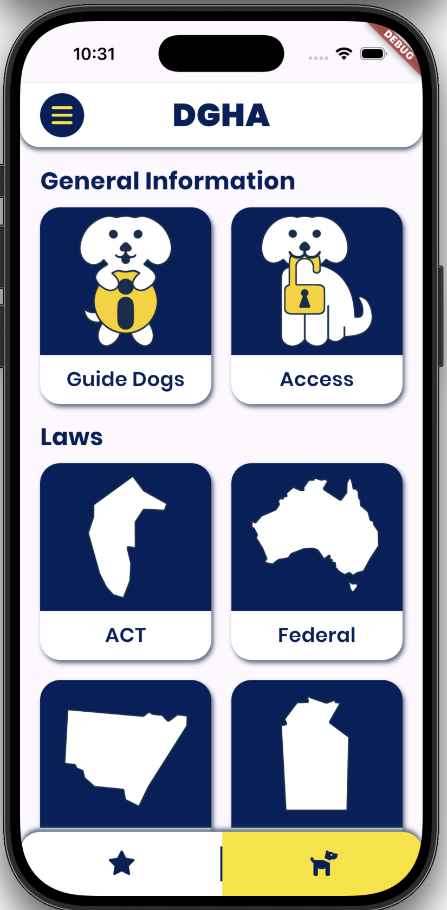
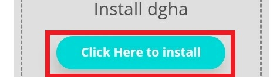
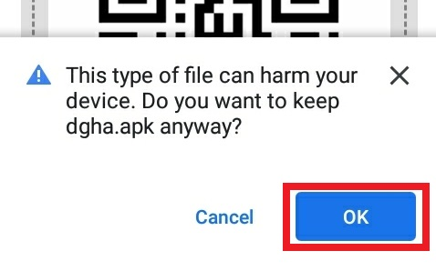
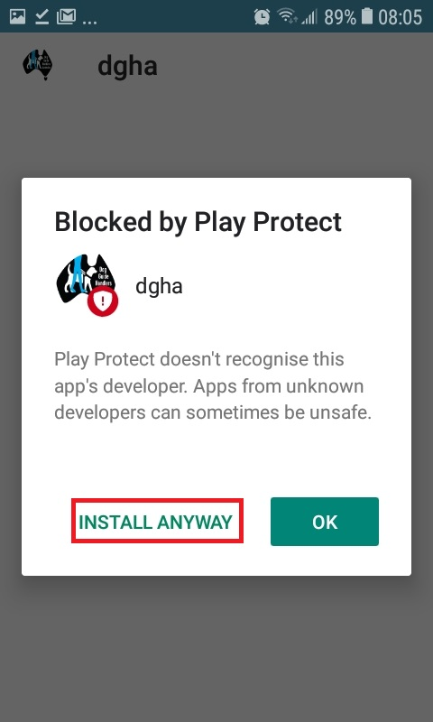

# Place rating app for dog guide handlers

A mobile app for guide dog handlers to find and review accessible venues.

[Backend app](https://github.com/jamtowers/DGHA-Backend)

## Demo
Demo video: https://drive.google.com/file/d/1HcPo4uA2fSA8bCbiWyvOx4JeQk-nSHYI/view

## Screenshots

<table>
<tr>
  <th width="33%">Explore</th>
  <th width="33%">Reviews</th>
  <th width="33%">Information Hub</th>
</tr>
<tr>
  <td width="33%"></td>
  <td width="33%"></td>
  <td width="33%"></td>
</tr>
</table>

## Install the app (deprecated)

This was written when the app was deployed for user testing

### Android

#### 1. Download the APK

> Required to be on an android device

[Download Link](http://bit.ly/2DquBRx)

**QR**

#### 2. Select "Click Here to Install"

#### 3. Select OK

#### 4. Select "Install"

#### 5. Select "Install Anyway"

## Developers

https://github.com/spaaacey (me, Chu)

https://github.com/josephkhaipi

https://github.com/jamtowers

https://github.com/Thornie

## Flutter Installation and Set up
https://flutter.dev/docs/get-started/install

